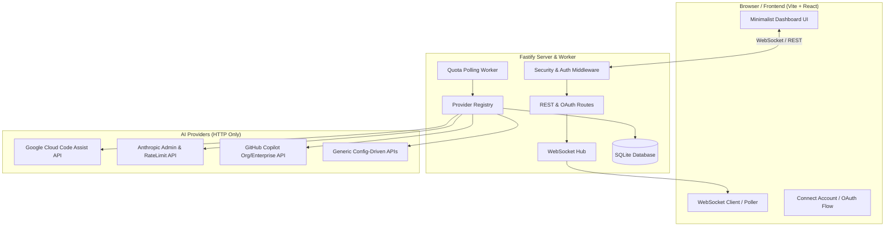

# AI Quota Dashboard — Architecture & Implementation Plan

## Executive Summary
A lightweight, modern, self-contained AI Quota & Usage Dashboard designed to run seamlessly in Docker or on a remote Linux/macOS server. The application requires **zero local AI CLI dependencies** and retrieves quota metrics directly over HTTP/REST and OAuth APIs. It features multi-account support across AI providers (Google Antigravity, Anthropic Claude, GitHub Copilot, and custom providers), real-time WebSocket updates, SQLite time-series history, and configurable multi-mode authentication.

---

## Technical Stack & Architecture

### 1. Technology Choices
- **Runtime**: Node.js 20+ (LTS) with TypeScript across backend and frontend.
- **Backend**: **Fastify** (or Express) — minimal memory footprint (< 50MB RSS), high throughput, native async, and clean WebSocket support via `@fastify/websocket`.
- **Database**: **SQLite** via `better-sqlite3` — zero configuration, single file, instant transactions, and embedded time-series logging for quota history.
- **Frontend**: **Vite + React + Tailwind CSS + Lucide Icons + Recharts** — sleek, minimalist UI, dark/light theme, interactive countdown timers, and responsive dashboard cards.
- **Packaging**: Multi-stage `Dockerfile` and `docker-compose.yml` with persistent volume for SQLite data.

### 2. High-Level Architecture Diagram



---

## Key Features & Modules

### 1. Extensible Provider Architecture (`src/backend/providers/`)
Each provider implements a clean TypeScript interface (`IProvider`):
```typescript
interface IProvider {
  id: string;
  name: string;
  authType: 'oauth' | 'api_key' | 'cookie' | 'custom';
  fetchQuota(account: AccountRecord): Promise<QuotaSnapshot>;
  refreshToken?(account: AccountRecord): Promise<TokenRefreshResult>;
  getOAuthUrl?(redirectUri: string, state: string): string;
  exchangeOAuthCode?(code: string, redirectUri: string): Promise<OAuthTokens>;
}
```

#### Provider Implementations:
1. **Google Antigravity Provider**:
   - Built-in web redirect OAuth flow (`/api/auth/google/login` & `/api/auth/google/callback`). No need to run CLI or manually copy tokens.
   - Calls `POST https://cloudcode-pa.googleapis.com/v1internal:loadCodeAssist` to discover `cloudaicompanionProject` and subscription tier (`FREE`, `PRO`, `ULTRA`).
   - Calls `POST https://cloudcode-pa.googleapis.com/v1internal:retrieveUserQuota` to retrieve quota buckets, model fractions (0.0 to 1.0), and `resetTime`.
   - Autonomous token refresh via `https://oauth2.googleapis.com/token`.
2. **Anthropic Claude Provider**:
   - Support for Admin API keys (`GET https://api.anthropic.com/v1/organizations/rate_limits`) and lightweight request rate-limit header parsing.
   - Multi-key and multi-organization support.
3. **GitHub Copilot Provider**:
   - REST API metrics for Organization & Enterprise accounts (`GET /orgs/{org}/copilot/billing/usage`).
   - Clean interface stubbed for future personal account scraping.
4. **Config-Driven REST Provider**:
   - Allows users to add generic REST providers via JSON/YAML config specifying URL, headers, and JSONPath mapping for remaining quota.

### 2. Multi-Account Management & Persistence
- Dedicated `/data` Volume Mount & Auto-Initialization:
  - All persistent state is consolidated under a single directory (defaults to `/data` in Docker, `./data` in local dev).
  - **Initially Empty & Self-Healing**: The `/data` directory can be completely empty on first launch.
    - If missing, the app creates `DATA_DIR` automatically (`fs.mkdirSync(..., { recursive: true })`).
    - If `/data/accounts.json` does not exist, it is initialized with default structure `{ "accounts": [] }`.
    - If `/data/quota.db` does not exist, SQLite automatically creates it and runs idempotent migrations (`CREATE TABLE IF NOT EXISTS ...`).
  - **Docker Reinstalls / Re-mounts**: Pointing a fresh container to an existing `/data` folder seamlessly picks up all prior accounts, refresh tokens, and historical data with zero reconfiguration.
  - `/data/quota.db`: SQLite database storing quota snapshots, time-series metrics, and settings.
  - `/data/accounts.json`: Securely stores configured accounts, OAuth refresh tokens, API keys, and custom provider configurations.
  - Hot-reloaded / watched: Any manual edit or external update to `/data/accounts.json` is automatically detected and loaded without restarting the container.
- SQLite Database schema:
  - `accounts`: ID, provider_id, label, email, credentials (encrypted at rest), status, created_at, updated_at.
  - `quota_snapshots`: Account ID, provider ID, model/metric name, remaining_fraction, reset_time, raw_payload, recorded_at.
  - `settings`: Polling frequency, WebSocket toggle, auth mode, retention period (default 30 days).
- Support for multiple accounts per provider (e.g. 3 Google accounts, 2 Anthropic keys, 1 GitHub org) with distinct status indicators and quota aggregation.

### 3. Real-Time Updates & Polling Daemon
- Background worker polls providers at user-configurable intervals (e.g., every 2 to 15 minutes).
- WebSocket pushes live quota changes, reset countdowns, and connection states to active clients.
- Frontend supports a fallback polling mode with toggle and custom frequency in UI settings.

### 4. Configurable Multi-Mode Authentication
Configurable via environment variables or dashboard settings:
1. **Username/Password or Token**: Simple session-based or Bearer token protection.
2. **IP Whitelist**: Restrict access to designated CIDR blocks or IP lists.
3. **Reverse Proxy Auth**: Trust authentication headers (e.g. `X-Forwarded-User`, `Remote-User`) behind Caddy/Nginx/Traefik.
4. **No Auth**: Open access for private internal networks or localhost.

### 5. UI/UX Design (Modern & Minimalist)
- **Overview Deck**: High-level system cards displaying total accounts, active models, nearest quota resets, and warning badges.
- **Provider & Account Cards**:
  - Radial progress rings and sleek progress bars for remaining quota percentage.
  - Real-time countdown timer to reset (e.g. "Resets in 2h 14m").
  - Breakdown by model (Gemini 3 Pro, Claude 3.5 Sonnet, Copilot Chat, etc.).
  - Account status badges (`Active`, `Exhausted`, `Token Expired`).
- **Interactive "Add Account" Modal**:
  - One-click Google OAuth "Sign in with Google" button with automatic callback handling.
  - API Key input forms for Anthropic and GitHub.
- **Settings & Analytics Drawer**:
  - Historical burn rate graphs (24h / 7d / 30d).
  - Polling frequency slider, WebSocket switch, and future Webhook Alerts configuration placeholder.
  - Dark and light theme switcher.

### 6. Containerization & Deployment
- Production `Dockerfile`: Multi-stage build producing an ultra-lightweight Node alpine container image.
- `docker-compose.yml`:
  - Binds server port (default `3456`).
  - Defines a dedicated persistent volume mount for `/data` (e.g. `./data:/data`), ensuring SQLite database, config, and refresh tokens persist across rebuilds and restarts.
  - Environment variable configuration via `.env` file (`DATA_DIR=/data`).

---

## File Structure Plan

```
ai-quota-dashboard/
├── Dockerfile
├── docker-compose.yml
├── .env.example
├── data/                        # Persistent volume mount point (/data, initially empty, auto-created)
│   ├── quota.db                 # SQLite database (auto-initialized on startup)
│   └── accounts.json            # Accounts & tokens (auto-initialized to {"accounts":[]})
├── package.json
├── tsconfig.json
├── apps/
│   ├── backend/
│   │   ├── src/
│   │   │   ├── index.ts                 # Server entrypoint
│   │   │   ├── config.ts                # Env and configuration loader
│   │   │   ├── db/                      # SQLite schema and repositories
│   │   │   │   ├── index.ts
│   │   │   │   └── schema.sql
│   │   │   ├── middleware/              # Auth & security middleware
│   │   │   │   └── auth.ts
│   │   │   ├── providers/               # Provider plugin system
│   │   │   │   ├── index.ts             # Registry & interface
│   │   │   │   ├── googleAntigravity.ts # Google OAuth + Cloud Code API
│   │   │   │   ├── anthropic.ts         # Claude Admin API
│   │   │   │   ├── githubCopilot.ts     # Copilot REST API
│   │   │   │   └── genericRest.ts       # Config-driven REST provider
│   │   │   ├── services/
│   │   │   │   ├── scheduler.ts         # Polling daemon
│   │   │   │   └── websocket.ts         # Real-time WS hub
│   │   │   └── routes/
│   │   │       ├── api.ts               # REST API endpoints
│   │   │       └── auth.ts              # OAuth callback routes
│   └── frontend/
│       ├── index.html
│       ├── vite.config.ts
│       ├── src/
│       │   ├── App.tsx
│       │   ├── components/
│       │   │   ├── Header.tsx           # Nav, Theme toggle, Status
│       │   │   ├── OverviewStats.tsx    # Summary metric cards
│       │   │   ├── AccountCard.tsx      # Account & Model quota gauge
│       │   │   ├── AddAccountModal.tsx  # OAuth & API Key modal
│       │   │   ├── HistoryChart.tsx     # Historical trend graphs
│       │   │   └── SettingsModal.tsx    # Polling & Auth settings
│       │   ├── hooks/
│       │   │   └── useQuotaStream.ts    # WS + Polling hook
│       │   └── types/
│       │       └── quota.ts
```

---

## Verification & Testing Plan

### 1. Automated Tests
- Unit tests for Provider response parsers (`GoogleAntigravity`, `Anthropic`, `GitHubCopilot`).
- Database migration and CRUD tests with in-memory SQLite.
- Authentication middleware tests covering Token, IP whitelist, Reverse Proxy headers, and No-Auth modes.

### 2. Manual Verification
- **Empty `/data` Auto-Bootstrap Test**: Start the app with an empty (or non-existent) `data/` directory; verify that `data/` is created, `accounts.json` defaults to `{"accounts":[]}`, and `quota.db` creates tables cleanly.
- **Docker Re-mount Test**: Add an account via UI, shut down container, delete container, re-mount the same `data/` folder in a new container, and verify all accounts, tokens, and history are preserved without re-authenticating.
- **Google OAuth Verification**: Trigger the OAuth flow from UI, authorize with Google, verify automated redirect, token persistence in `/data/accounts.json`, and quota extraction from `cloudcode-pa.googleapis.com`.
- **Live WebSocket Test**: Verify live status broadcasting when polling triggers or upon manual refresh button click.
